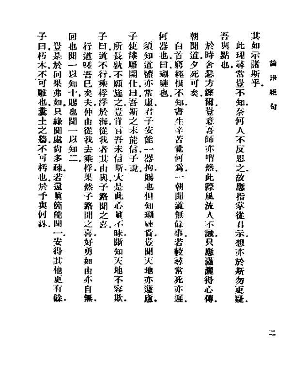
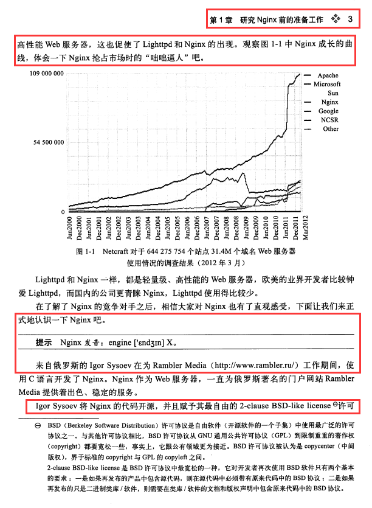
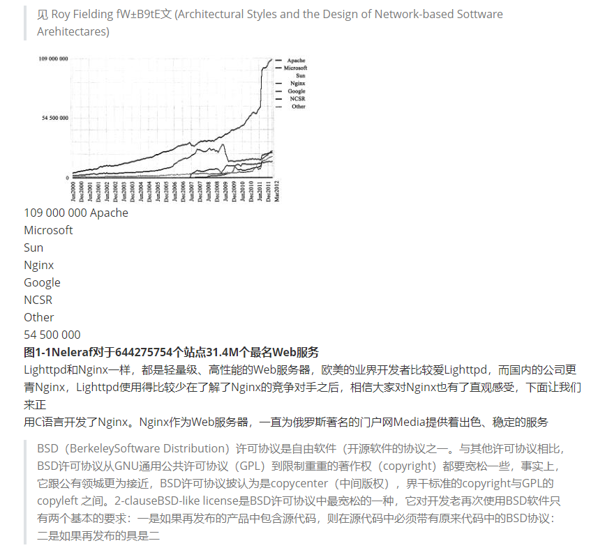

# Type of pdfs

PDF files can be divided into two types: text-based (such as generated by the word processing software) and image-based (such as generated by scanning paper documents).

Text-based PDF: This type of PDF  contain real text information, each character is encoded and has a clear location, font and other attributes, you can directly access and manipulate the text data.
Image-based PDF: This type of PDF is generated by scanning paper documents and saved in the form of an image , there is no independent text information, you can try OCR to extract text from the image.


# Dependencies
`pip install -r requirements.txt`

if you have GPUs, you can install the GPU version of PaddlePaddle, It is up to your environment. referring to this link: https://www.paddlepaddle.org.cn/documentation/docs/zh/install/pip/windows-pip.html

`pip install paddlepaddle-gpu==2.6.1 -i https://mirror.baidu.com/pypi/simple`


# Run

`python start.py -h`

- `-type`：file or dir or photo

+ `-f`：a single pdf file path
+ `-d`：pdf directory path
+ `-p`：a single photo path


# Limits

 It is suitable for dealing with Chinese pdf of single column layout, horizontal typography without formulas, matrices  .

Why Chinese? Because the Paddleocr recognize Chinese better than other languages.

if you want to convert English pdfs to markdown, I would recommend [marker](https://github.com/VikParuchuri/marker). and if you can accept paid service, I recommend [mathpix](https://mathpix.com/)


## Time

Depending on the composition of this pdf page, it may take 7-12 seconds to parse one page.


## Disadvantages

- It can't handle this kind of vertically typography pdfs

but during my testing, [mathpix](https://mathpix.com/) also did a poor job of recognizing this type of pdf.



-  Paddleocr has limited completeness in recognizing pdfs with low clarity.

 for example，the red circle is the unrecognized area of the Paddleocr.



the result of parsing this page above:



-  PPStructure only supports English and Chinese. Its recognizable Chinese layouts are text, title, figure, figure_caption, table, table_caption, header, footer, reference, equation, it doesn't support mathematical formulas, matrices and so on.


you can see from  PPStructure source code:

```python
'PP-StructureV2': {
            'layout': {
                'en': {
                    'url':
                    'https://paddleocr.bj.bcebos.com/ppstructure/models/layout/picodet_lcnet_x1_0_fgd_layout_infer.tar',
                    'dict_path':
                    'ppocr/utils/dict/layout_dict/layout_publaynet_dict.txt'
                },
                'ch': {
                    'url':
                    'https://paddleocr.bj.bcebos.com/ppstructure/models/layout/picodet_lcnet_x1_0_fgd_layout_cdla_infer.tar',
                    'dict_path':
                    'ppocr/utils/dict/layout_dict/layout_cdla_dict.txt'
                }
            }
```

the content of layout_cdla_dict.txt is as follows:

```txt
text
title
figure
figure_caption
table
table_caption
header
footer
reference
equation
```
